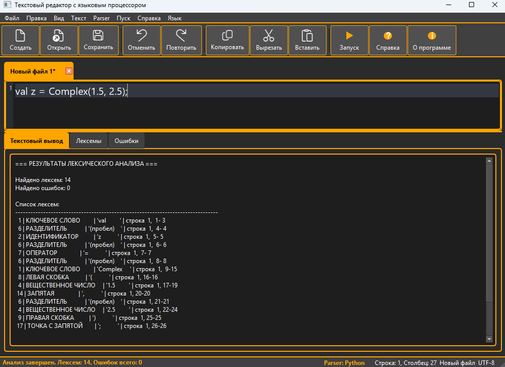
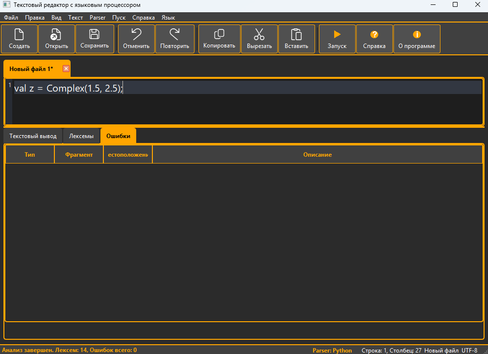
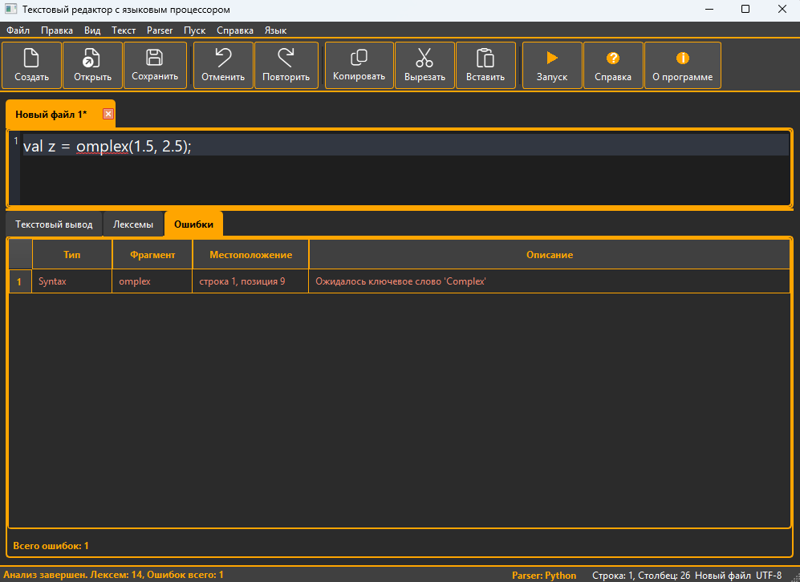
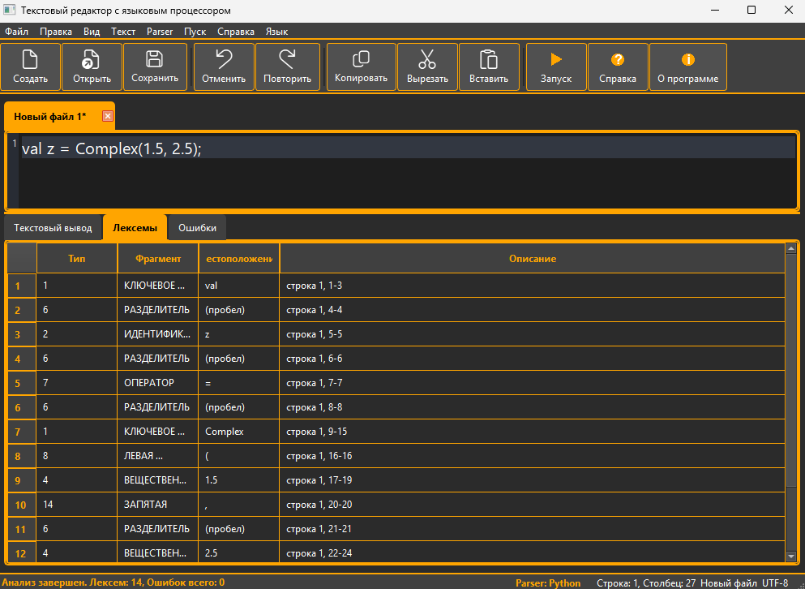
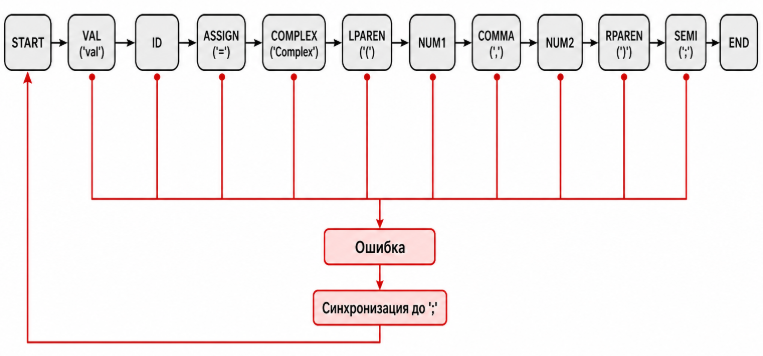

# Курсовая работа (вариант 8): объявление комплексного числа в Scala

Проект — учебный языковой процессор (PyQt6), который выполняет:
- лексический анализ введённого текста;
- синтаксический анализ (2 режима: автоматный парсер на Python и ANTLR);
- вывод таблиц лексем и ошибок с навигацией по позициям.

---

## 2. Сведения об авторе

- **Студент:** Васильев Антон Романович
- **Группа:** АВТ-314
- **Вариант задания:** 8
- **Дата выполнения:** 2026

---

## 3. Постановка задачи

Разработать синтаксический анализатор (парсер) для конструкции объявления комплексного числа в языке Scala, интегрировать его в графический интерфейс языкового процессора и обеспечить наглядный вывод результатов анализа.

### Требования к разработке парсера:

1. **Разработать грамматику** для конструкции объявления комплексного числа Scala.
2. **Выполнить программную реализацию** синтаксического анализа:
   - автоматным парсером (конечный автомат);
   - парсером ANTLR (генерация лексера/парсера по `.g4`).
3. **Реализовать нейтрализацию ошибок** (синхронизация по `;`).
4. **Обеспечить ввод/вывод**: текст из редактора → таблица лексем и список ошибок с позициями.

### Требования к интеграции и интерфейсу:

1. **Встроить парсер** в ранее разработанный интерфейс (ЛР1) и связать его с кнопкой «Пуск»
2. **Окно вывода результатов** должно содержать таблицу ошибок со следующими столбцами:
   - **Неверный фрагмент** — символ или фрагмент, вызвавший ошибку
   - **Местоположение** — номер строки, позиция символа
   - **Описание ошибки** — текстовое описание проблемы
3. **Отображение общего количества** найденных ошибок
4. **Реализовать навигацию по ошибкам** — при щелчке на строке таблицы курсор в области редактирования устанавливается на позицию ошибочного фрагмента

---

## 4. Вариант задания

### 4.1 Текстовое описание

**Вариант 8:** Объявление комплексного числа в языке Scala.

### 4.2 Перечень допустимых языковых конструкций

Поддерживается строго одна синтаксическая конструкция (корректная):

`val z = Complex(1.5, 2.5);`

Обобщенная форма:

`val <идентификатор> = Complex(<число>, <число>);`

Где:
- `<идентификатор>` — буква/`_`, далее буквы/цифры/`_`;
- `<число>` — целое или вещественное в форме `d+` или `d+.d+`.

### 4.3 Примеры корректных входных строк

```scala
val z = Complex(1.5, 2.5);
```

---

## 5. Разработка грамматики

Определим грамматику объявления комплексного числа языка Scala `G[‹START›]` в нотации Хомского с продукциями `P`.

Корректная конструкция варианта 8:

```scala
val z = Complex(1.5, 2.5);
```

Обобщённый вид конструкции:

```text
val <id> = Complex(<num>, <num>);
```

Продукции грамматики:

```text
1.  ‹START›        → 'val' ‹ID›
2.  ‹ID›           → letter ‹ID_TAIL›
3.  ‹ID_TAIL›      → letter ‹ID_TAIL› | digit ‹ID_TAIL› | '_' ‹ID_TAIL› | '=' ‹COMPLEX›
4.  ‹COMPLEX›      → 'Complex' ‹LPAREN›
5.  ‹LPAREN›       → '(' ‹NUM1›
6.  ‹NUM1›         → digit ‹NUM1_TAIL›
7.  ‹NUM1_TAIL›    → digit ‹NUM1_TAIL› | '.' ‹FRAC1› | ',' ‹NUM2›
8.  ‹FRAC1›        → digit ‹FRAC1_TAIL›
9.  ‹FRAC1_TAIL›   → digit ‹FRAC1_TAIL› | ',' ‹NUM2›
10. ‹NUM2›         → digit ‹NUM2_TAIL›
11. ‹NUM2_TAIL›    → digit ‹NUM2_TAIL› | '.' ‹FRAC2› | ')' ‹SEMI›
12. ‹FRAC2›        → digit ‹FRAC2_TAIL›
13. ‹FRAC2_TAIL›   → digit ‹FRAC2_TAIL› | ')' ‹SEMI›
14. ‹SEMI›         → ';'
```

Следуя формальному определению грамматики, представим `G[‹START›]` её составляющими:

- `Z = ‹START›`;
- `VT = { 'val', 'Complex', '=', '(', ',', ')', ';', '.', letter, digit, '_' }`;
- `VN = { ‹START›, ‹ID›, ‹ID_TAIL›, ‹COMPLEX›, ‹LPAREN›, ‹NUM1›, ‹NUM1_TAIL›, ‹FRAC1›, ‹FRAC1_TAIL›, ‹NUM2›, ‹NUM2_TAIL›, ‹FRAC2›, ‹FRAC2_TAIL›, ‹SEMI› }`.

Здесь:

```text
letter = a | b | ... | z | A | B | ... | Z
digit  = 0 | 1 | ... | 9
```

Грамматика ANTLR для этого варианта находится в файле `ScalaComplex.g4`.

---

## 6. Классификация грамматики

Согласно классификации Хомского, грамматика `G[‹START›]` является **автоматной**.

Правила (1)-(14) относятся к классу праворекурсивных продукций:

```text
A → aB
A → a
```

В правых частях продукций терминальный символ расположен перед нетерминалом либо продукция завершается терминальным символом. Это соответствует регулярной праволинейной грамматике.

Основная цепочка разбора:

```text
‹START› → 'val' → ‹ID› → '=' → 'Complex' → '(' → ‹NUM1› → ',' → ‹NUM2› → ')' → ';'
```

Лексемы идентификатора и чисел также описываются регулярными правилами:

```text
ID  → letter (letter | digit | '_')*
NUM → digit+ | digit+ '.' digit+
```

Следовательно, грамматика варианта 8 относится к **типу 3** по классификации Хомского и может быть реализована конечным автоматом.

---

## 7. Метод анализа

Грамматика `G[‹START›]` является автоматной, поэтому правила (1)-(14) реализованы на графе состояний (см. рисунок 1).

Сплошные стрелки на графе характеризуют синтаксически верный разбор объявления комплексного числа языка Scala. Красные переходы символизируют состояние ошибки `ERROR` и переход к синхронизации по символу `;`.

Конечное состояние автомата символизирует успешное завершение разбора конструкции:

```scala
val z = Complex(1.5, 2.5);
```

![Граф грамматики G[‹START›]](screenshots/automaton_scheme.png)

Рисунок 1 — Граф грамматики `G[‹START›]`

В программе используются два режима синтаксического анализа:

- **Автоматный парсер (Python)** — последовательная проверка токенов конечным автоматом с нейтрализацией ошибок.
- **ANTLR** — независимая проверка по грамматике `ScalaComplex.g4`.

---

## 8. Диагностика и нейтрализация синтаксических ошибок

### 8.1 Метод нейтрализации ошибок: Метод Айронса

**Принцип работы:**
При обнаружении синтаксической ошибки парсер:
1. Регистрирует ошибку с информацией о позиции и тип ошибки
2. Пропускает ошибочный токен
3. Продолжает анализ до ближайшего **синхронизирующего токена**
4. Возобновляет анализ с синхронизирующего токена

**Синхронизирующие токены:**
- `;` (конец объявления)
- EOF

### 8.2 Обработка ошибок в приложении

**Класс `SyntaxErrorRecord` (parser.py):**
```python
@dataclass
class SyntaxErrorRecord:
    fragment: str      # Неверный фрагмент
    line: int          # Номер строки
    col: int           # Позиция символа
    message: str       # Описание ошибки
    
    def location_ru(self) -> str:
        return f"строка {self.line}, позиция {self.col}"
    
    def location_en(self) -> str:
        return f"line {self.line}, position {self.col}"
```

**Классы `LexerErrorListener` и `ParserErrorListener` (antlr_parser_adapter.py):**
- Собирает все ошибки в процессе анализа
- Поддерживает локализацию (русский/английский)
- Форматирует сообщения об ошибках

### 8.3 Примеры ошибок и их обработка

| Неверный фрагмент | Местоположение | Описание |
|---|---|---|
| `==` | строка 1, позиция 7 | Ожидался оператор `=` |
| `;` | строка 1, позиция 20 | Ожидалась `,` между аргументами |
| `.5` | строка 1, позиция 17 | Ожидалось число в корректном формате |
| `EOF` | строка 1, позиция 26 | Ожидалась `;` в конце объявления |

---

## 9. Тестовые примеры

### 9.1 Корректный ввод

```scala
val z = Complex(1.5, 2.5);
```

Ожидается: ошибок нет.

### 9.2 Пример ошибки (пропущена `;`)

```scala
val z = Complex(1.5, 2.5)
```

Ожидается: синтаксическая ошибка «Ожидалась `;` в конце объявления».

---

## 10. Архитектура приложения

### 10.1 Структура файлов проекта

```
Compiler_LAB_3/
├── main.py                 # GUI + запуск анализатора
├── scanner.py              # Лексический анализатор
├── parser.py               # Автоматный синтаксический анализатор
├── antlr_parser_adapter.py # Запуск ANTLR-парсера из GUI
├── ScalaComplex.g4         # Грамматика ANTLR (вариант 8)
├── antlr_generated/        # Сгенерированные файлы ANTLR
├── antlr4/                 # JAR и .bat для генерации
├── screenshots/            # Скриншоты и изображения для отчёта
├── translator.py           # Локализация интерфейса
└── README.md
```

### 10.2 Интегрированная обработка анализа

1. **Лексический анализ** (`scanner.py`) → токены
2. **Синтаксический анализ**:
   - `parser.py` (автоматный парсер),
   - `antlr_parser_adapter.py` + ANTLR (альтернативный режим)
3. **Отображение результатов** (`main.py` + `result_tabs.py`)

## 11. Грамматика (автоматная, праворекурсивная)

Кратко (в нотации правил):

`<START> → 'val' <SPACE> <ID> <SPACE> '=' <SPACE> 'Complex' '(' <NUM> ',' <SPACE> <NUM> ')' ';'`
---

## 12. Скриншоты и изображения

Все скриншоты и иллюстрации для отчёта хранятся в папке `screenshots/`.

### 12.1 Общий вид программы

<!-- Заменить имя файла на свой скриншот общего окна программы -->


### 12.2 Корректный пример анализа

<!-- Скриншот анализа строки: val z = Complex(1.5, 2.5); -->


### 12.3 Пример обнаружения ошибок

<!-- Скриншот таблицы ошибок для некорректной конструкции -->


### 12.4 Таблица лексем

<!-- Скриншот вкладки "Лексемы" -->


### 12.5 Схема автомата

<!-- Картинка/схема автомата для варианта 8 -->


---

**Документация создана:** 2026
**Язык программирования:** Python 3.9+
**Фреймворк UI:** PyQt6
**Генератор парсера:** ANTLR 4.13.2